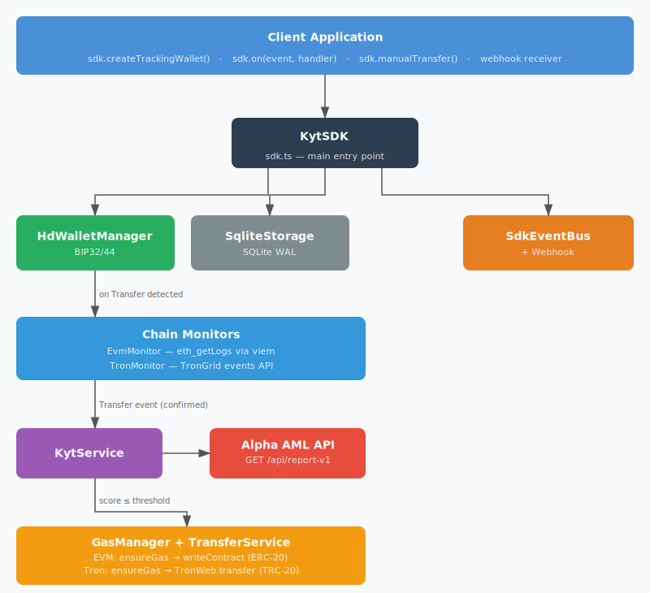
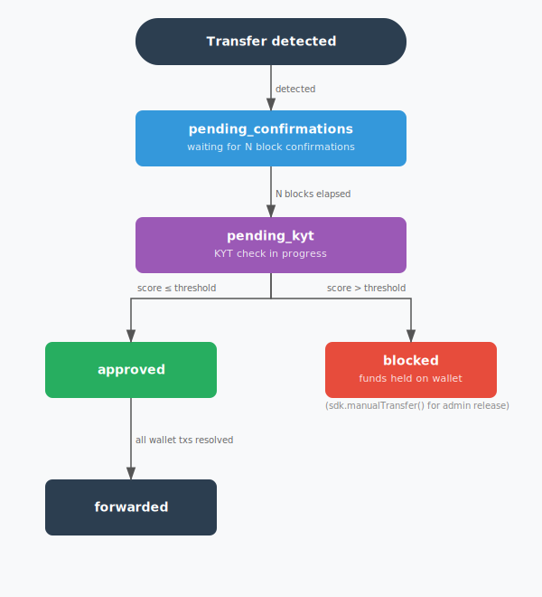
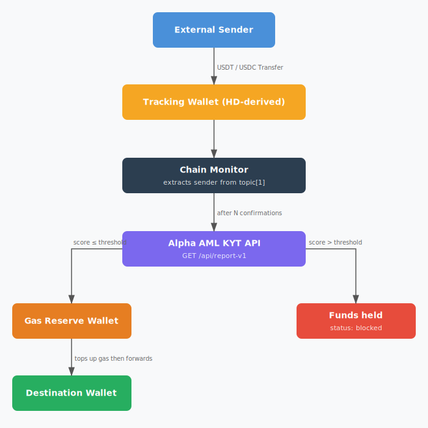
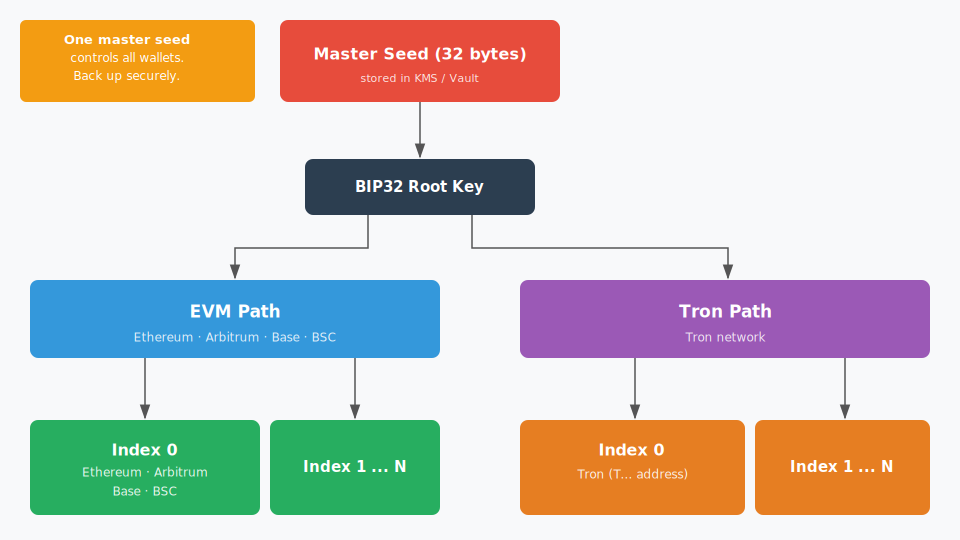
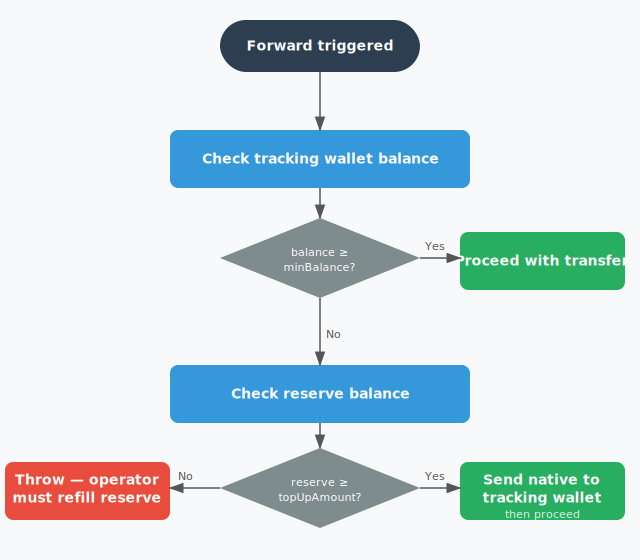

# Architecture

## Overview

The SDK is a self-contained Node.js library with no external service dependencies beyond the configured RPC endpoints and the Alpha AML API.  All state is persisted in a local SQLite database.

## Component diagram

## Transaction state machine

Each detected transfer moves through the following states:

**Hold-everything rule**: forwarding only triggers when every transaction on the tracking wallet is in a terminal state (`approved`, `blocked`, or `forwarded`).  If any transaction is still pending, no forwarding occurs.  Blocked-token amounts are computed from the per-transaction amounts stored in the database, so only the approved portion is forwarded even when a wallet has a mixture of clean and risky transactions.

## Token flow

## HD wallet derivation

EVM wallets use coin type 60.  Tron wallets use coin type 195.  The same numerical index on different coin types produces entirely different key material — there is no relationship between the EVM and Tron addresses at the same index.

## Gas management

The gas manager runs automatically before each forwarding operation:

Default gas thresholds (configurable via `GasConfig`):

| Chain | Min balance (trigger) | Top-up amount |
|---|---|---|
| Ethereum | 0.003 ETH | 0.01 ETH |
| Arbitrum | 0.0001 ETH | 0.0005 ETH |
| Base | 0.0001 ETH | 0.0005 ETH |
| BSC | 0.001 BNB | 0.005 BNB |
| Tron | 30 TRX | 100 TRX |

## Storage schema

Three tables in the SQLite database:

**`tracking_wallets`** — one row per created wallet.  Contains the EVM/Tron address, chain list, destination, thresholds, and status.

**`transactions`** — one row per detected Transfer event.  Tracks the transaction status through the state machine, stores the KYT score and response, and records forwarding timestamps.

**`monitor_state`** — one row per (wallet, chain) pair.  Stores the last processed block number so polling resumes from the correct position after a restart.

## Polling

The SDK uses a polling model (no WebSocket subscriptions).  For EVM chains, `eth_getLogs` is called with the Transfer event signature filtered by the tracking wallet address, scanning at most 1000 blocks per poll.  For Tron, the TronGrid events API is queried for `only_confirmed=true` Transfer events, which handles block confirmations server-side.

Polling is timer-based per wallet.  Each wallet's timer fires independently according to its configured `pollingIntervalMs`.  On startup, the SDK resumes from the last stored block number, so no transfers are missed across restarts.
